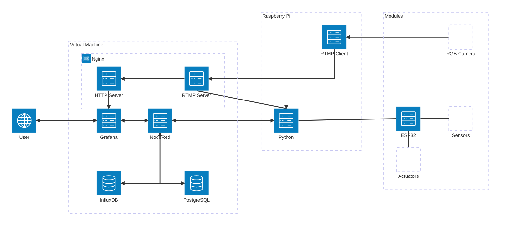
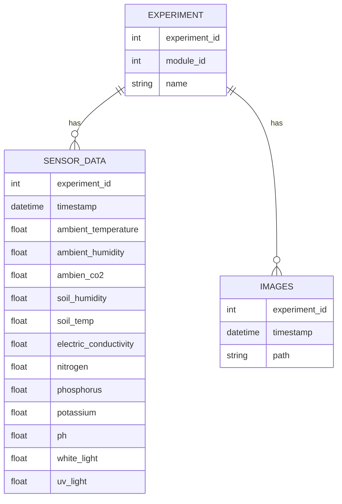

# Camara de Crecimiento - SISE

## Architecture Diagram

```mermaid
architecture-beta

    service user(internet)[User]
    
    group vm[Virtual Machine]

    service grafana(server)[Grafana] in vm
    service nodered(server)[NodeRed] in vm
    service influx(database)[InfluxDB] in vm
    service postgres(database)[PostgreSQL] in vm

    group nginx(server)[Nginx] in vm
    service rtmpserver(server)[RTMP Server] in nginx
    service httpserver(server)[HTTP Server] in nginx

    junction data in vm

    user:R <--> L:grafana
    grafana:R <--> L:nodered
    grafana:T <-- B:httpserver
    nodered:B <-- T:data
    data:L --> R:influx
    data:R --> L:postgres
    httpserver:R <-- L:rtmpserver

    group raspi[Raspberry Pi]

    service rtmpclient(server)[RTMP Client] in raspi
    service python(server)[Python] in raspi

    junction video in raspi

    nodered:R <--> L:python
    rtmpserver:R <-- L:video
    video:T -- B:rtmpclient
    rtmpserver:B --> T:python

    group module[Modules]

    service camera[RGB Camera] in module
    service sensors[Sensors] in module
    service actuators[Actuators] in module
    service esp(server)[ESP32] in module


    python:R -- L:esp
    esp:R -- L:sensors
    esp:B -- T:actuators
    rtmpclient:R <-- L:camera
```

## Entity-Relationship Diagram

```mermaid
erDiagram

    SENSOR_DATA {
        int experiment_id
        datetime timestamp
        float ambient_temperature
        float ambient_humidity
        float ambien_co2
        float soil_humidity
        float soil_temp
        float electric_conductivity
        float nitrogen
        float phosphorus
        float potassium
        float ph
        float white_light
        float uv_light
    }

    EXPERIMENT {
        int experiment_id
        int module_id
        string name
    }

    IMAGES {
        int experiment_id
        datetime timestamp
        string path
    }

    EXPERIMENT ||--o{ SENSOR_DATA : has
    EXPERIMENT ||--o{ IMAGES : has
```
