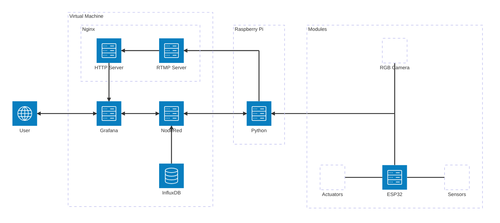
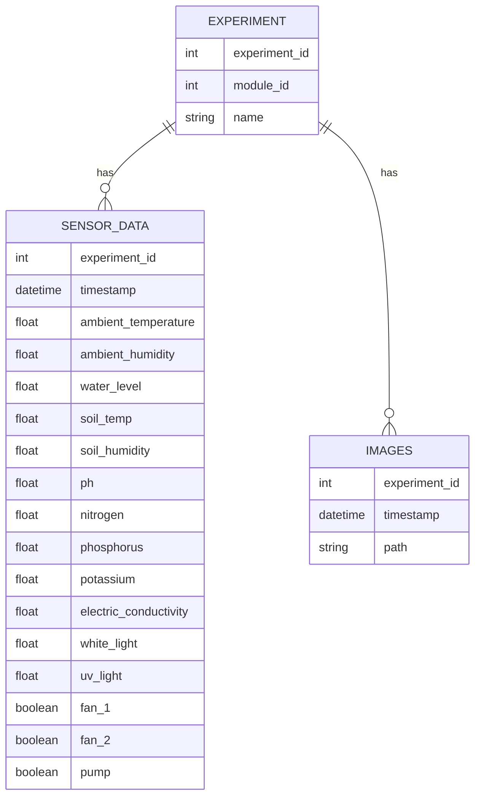
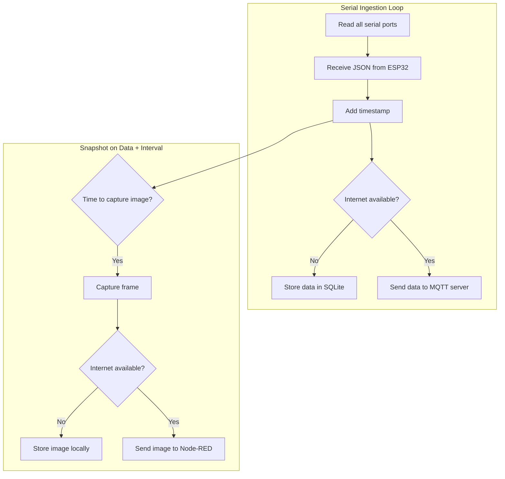
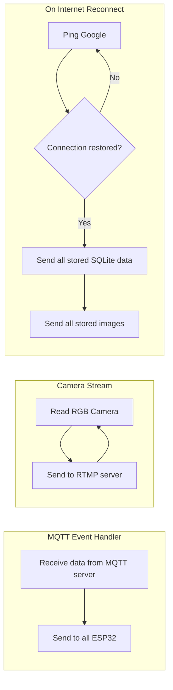

# Camara de Crecimiento - SISE

## Architecture Diagram

```mermaid
architecture-beta

    service user(internet)[User]
    
    group vm[Virtual Machine]

    service grafana(server)[Grafana] in vm
    service nodered(server)[NodeRed] in vm
    service influx(database)[InfluxDB] in vm

    group nginx[Nginx] in vm
    service rtmpserver(server)[RTMP Server] in nginx
    service httpserver(server)[HTTP Server] in nginx

    junction data in vm

    user:R <--> L:grafana
    grafana:R <--> L:nodered
    grafana:T <-- B:httpserver
    nodered:B <-- T:influx
    httpserver:R <-- L:rtmpserver

    group raspi[Raspberry Pi]

    service python(server)[Python] in raspi

    junction video in raspi

    nodered:R <--> L:python
    rtmpserver:R <-- L:video
    video:B -- T:python

    group module[Modules]

    service camera[RGB Camera] in module
    service sensors[Sensors] in module
    service actuators[Actuators] in module
    service esp(server)[ESP32] in module

    junction components in module


    esp:T -- B:components
    camera:B -- T:components
    components:L --> R:python
    esp:R -- L:sensors
    esp:L -- R:actuators
```

## Entity-Relationship Diagram

```mermaid
erDiagram

    SENSOR_DATA {
        %% Metadata
        int experiment_id
        datetime timestamp
        %% Sensors
        float ambient_temperature
        float ambient_humidity
        float water_level
        float soil_temp
        float soil_humidity
        float ph
        float nitrogen
        float phosphorus
        float potassium
        float electric_conductivity
        float white_light
        float uv_light
        %% Actuators
        boolean fan_1
        boolean fan_2
        boolean pump
    }

    EXPERIMENT {
        int experiment_id
        int module_id
        string name
    }

    IMAGES {
        int experiment_id
        datetime timestamp
        string path
    }

    EXPERIMENT ||--o{ SENSOR_DATA : has
    EXPERIMENT ||--o{ IMAGES : has
```

## Flowcharts

### Main Loop

```mermaid
flowchart TB

subgraph SerialLoop["Serial Ingestion Loop"]
    ReadPorts[Read all serial ports]
    ReceiveJSON[Receive JSON from ESP32]
    AddTimestamp[Add timestamp]

    CheckInternet{Internet available?}

    StoreSQLite[Store data in SQLite]
    SendMQTT[Send data to MQTT server]

    ReadPorts --> ReceiveJSON --> AddTimestamp --> CheckInternet

    CheckInternet -- Yes --> SendMQTT
    CheckInternet -- No --> StoreSQLite
end

subgraph Snapshot["Snapshot on Data + Interval"]
    Interval{Time to capture image?}
    CaptureFrame[Capture frame]

    CheckInternetImg{Internet available?}
    StoreImage[Store image locally]
    SendHTTP[Send image to Node-RED]

    Interval -- Yes --> CaptureFrame --> CheckInternetImg

    CheckInternetImg -- Yes --> SendHTTP
    CheckInternetImg -- No --> StoreImage
end

AddTimestamp --> Interval

```

### Other events

```mermaid
flowchart LR

subgraph MQTT["MQTT Event Handler"]
    ReceiveMQTT[Receive data from MQTT server]
    BroadcastESP[Send to all ESP32]

    ReceiveMQTT --> BroadcastESP
end

subgraph Stream["Camera Stream"]
    Camera[Read RGB Camera]
    RTMP[Send to RTMP server]

    Camera --> RTMP --> Camera
end

subgraph Reconnect["On Internet Reconnect"]
    ReconnectCheck[Ping Google]
    DetectReconnect{Connection restored?}

    FlushSQLite[Send all stored SQLite data]
    FlushImages[Send all stored images]

    ReconnectCheck --> DetectReconnect
    DetectReconnect -- Yes --> FlushSQLite
    DetectReconnect -- No --> ReconnectCheck
    FlushSQLite --> FlushImages
end
```